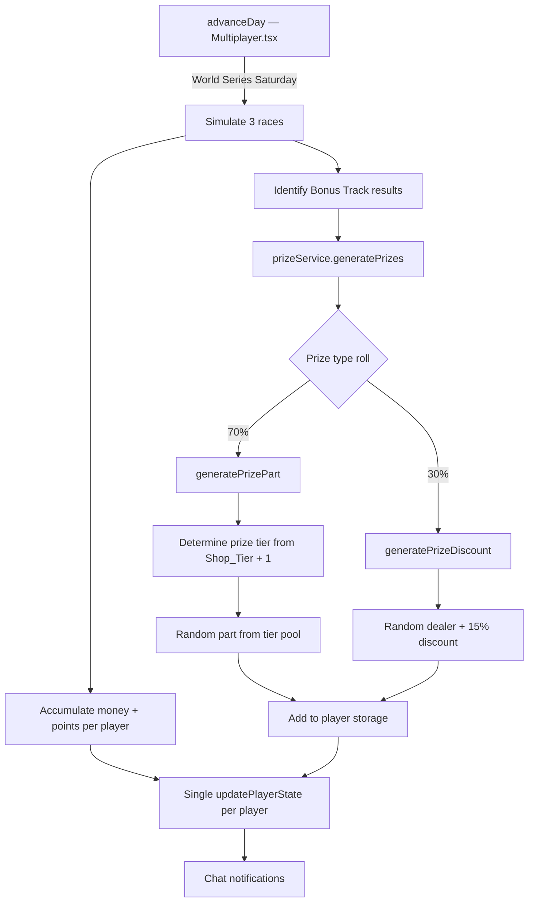

# Design Document: Prize System

## Overview

Система призов для мультиплеерной гоночной игры, отвечающая за генерацию и выдачу призов по результатам Bonus Track (Race 2) в рамках World Series (суббота, день 9). Призы бывают двух типов: запчасти (Prize_Part) с тиром на 1 выше магазинного и скидки (Prize_Discount) 15% на конкретный автосалон. Система также исправляет баг суммирования денег за все три гонки World Series.

### Ключевые решения

1. **Prize_Discount как элемент Storage**: Скидки хранятся в том же массиве `storage` (JSONB), что и запчасти, но с полем `type: 'discount'` для различения. Это позволяет использовать существующую инфраструктуру без миграций БД.
2. **Сервис генерации призов**: Выделен в отдельный модуль `services/prizeService.ts` для изоляции логики от UI и гоночного движка.
3. **Накопительное обновление**: Деньги, очки и призы за все 3 гонки World Series суммируются и применяются одним обновлением на игрока.

## Architecture



### Поток данных World Series Saturday

1. `advanceDay()` определяет, что текущий день — суббота World Series (dayNum=9, raceType='WORLD')
2. Для каждой из 3 гонок (worldSaturday, worldBonus, worldMain) симулируется гонка и результаты сохраняются
3. Деньги и очки за все 3 гонки **суммируются** в аккумулятор по игрокам
4. Для Bonus Track (Race 2) вызывается `generatePrizesForRace()` из prizeService
5. Все обновления (деньги, очки, storage с призами) применяются одним вызовом `updatePlayerState` на игрока
6. Отправляются системные сообщения в чат о призах

## Components and Interfaces

### prizeService.ts (новый файл: `services/prizeService.ts`)

```typescript
// Определяет максимальный тир доступных магазинов для текущего года
function getMaxShopTier(currentYear: number): number

// Определяет тир приза (Shop_Tier + 1, max 4)
function getPrizeTier(currentYear: number): number

// Генерирует один приз (Part или Discount)
function generateSinglePrize(currentYear: number): PrizePart | PrizeDiscount

// Генерирует массив призов для одного игрока по его позиции
function generatePrizesForPlayer(
  position: number, 
  playerCount: number, 
  currentYear: number
): (PrizePart | PrizeDiscount)[]

// Генерирует призы для всех игроков по результатам Bonus Track
function generatePrizesForRace(
  results: RaceResult[], 
  playerCount: number, 
  currentYear: number
): Map<string, (PrizePart | PrizeDiscount)[]>  // carId -> prizes
```

### Изменения в Multiplayer.tsx (advanceDay)

Текущая логика обрабатывает каждую гонку отдельно и сразу начисляет деньги. Новая логика:
- Аккумулирует `moneyByPlayer` и `pointsByPlayer` по всем 3 гонкам
- Вызывает `generatePrizesForRace` для Bonus Track
- Применяет всё одним `updatePlayerState` на игрока

### Изменения в Dealer.tsx

- При нажатии "КУПИТЬ" проверяет наличие Prize_Discount для текущего дилера в storage игрока
- Если есть — показывает модальное окно с выбором: использовать скидку или купить за полную цену
- При использовании скидки: цена × 0.85, удаление одного Prize_Discount из storage

### Изменения в Garage.tsx (Storage tab)

- Визуальное разделение Prize_Parts и Prize_Discounts
- Prize_Parts отображаются с индикатором "🏆 ПРИЗ" и тиром
- Prize_Discounts отображаются отдельным блоком с иконкой дилера, процентом скидки и счётчиком


## Data Models

### PrizeDiscount (новый тип в types.ts)

```typescript
interface PrizeDiscount {
  id: string;           // Уникальный ID (prize-discount-{timestamp}-{random})
  type: 'discount';     // Дискриминатор для отличия от Part
  dealer: string;       // Название дилера: 'АЛЬФА' | 'БЕТА' | 'ГАММА' | 'ДЕЛЬТА'
  discount: number;     // Процент скидки (15)
  name: string;         // Отображаемое имя: "Скидка 15% — АЛЬФА"
  icon: string;         // Иконка для отображения: 'Percent'
}
```

### PrizePart (расширение Part)

Призовые запчасти используют существующий интерфейс `Part` без изменений. Отличие:
- `id` имеет префикс `prize-` для идентификации
- `price` = 0 (приз бесплатный)
- `tier` = Shop_Tier + 1 (2, 3 или 4)

### Storage (изменение типа)

Текущий тип `storage: Part[]` в RoomPlayer расширяется до `storage: (Part | PrizeDiscount)[]`. Поскольку storage — JSONB в Supabase, изменение схемы БД не требуется. Дискриминация по полю `type`:
- Если `type === 'discount'` → PrizeDiscount
- Иначе → Part (обычная запчасть или призовая)

### Таблица тиров по годам

| Год комнаты | Разблокированные магазины | Max Shop_Tier | Prize Tier |
|---|---|---|---|
| 1960-1964 | У Ильсурика, Trash Shopito, Колянур, Девяточка, Таврия, Батыр | 1 | 2 |
| 1966-1968 | + ABC | 2 | 3 |
| 1970-1990 | + Breyton, ДымДымыч, Sumimoto, Волга+, TopCar | 2 | 3 |
| 1992-2006 | + Mugen, Hennesy, AMG, Dunlop | 3 | 4 |
| 2008+ | + Brabus, Ralliart | 3 | 4 |

### Структура rewards_data.json (worldBonus)

```json
{
  "place": 1,
  "money": 7000,
  "points": 0,
  "prizes": 2    // ← количество призов для генерации
}
```


## Correctness Properties

*A property is a characteristic or behavior that should hold true across all valid executions of a system — essentially, a formal statement about what the system should do. Properties serve as the bridge between human-readable specifications and machine-verifiable correctness guarantees.*

### Property 1: Prize count matches reward table

*For any* player count (3–8) and any finishing position, the number of prizes generated by `generatePrizesForPlayer` should equal the `prizes` field from the `worldBonus` table in `rewards_data.json` for that player count and position.

**Validates: Requirements 1.1, 1.2, 1.3**

### Property 2: Generated prizes are valid typed objects

*For any* generated prize, it should be either a valid Part (with id, name, boosts, price, icon, tier fields) or a valid PrizeDiscount (with type='discount', dealer ∈ {АЛЬФА, БЕТА, ГАММА, ДЕЛЬТА}, discount=15, name, icon fields).

**Validates: Requirements 2.1, 4.1, 4.2, 4.3, 5.2, 5.3**

### Property 3: Prize type distribution approximates 70/30

*For any* sufficiently large sample of generated prizes (≥200), the proportion of Prize_Parts should be between 55% and 85%, and the proportion of Prize_Discounts should be between 15% and 45%.

**Validates: Requirements 2.2**

### Property 4: Prize tier equals Shop_Tier + 1 capped at 4

*For any* valid room year, `getPrizeTier(year)` should return `min(getMaxShopTier(year) + 1, 4)`, where `getMaxShopTier` returns the maximum tier across all shops with `unlockYear <= year`.

**Validates: Requirements 3.1, 3.2, 3.3, 3.4**

### Property 5: Prize parts belong to the correct tier pool

*For any* generated Prize_Part for a given year, the part's tier should equal `getPrizeTier(year)` and the part should exist in the set of all parts of that tier from `shops_data.json`.

**Validates: Requirements 3.5, 10.2**

### Property 6: Prize IDs are unique

*For any* sequence of generated prizes (across multiple calls), all Prize_Part and PrizeDiscount IDs should be distinct.

**Validates: Requirements 3.6**

### Property 7: Prizes awarded only from Bonus Track

*For any* set of race results labeled with race types (worldSaturday, worldBonus, worldMain), `generatePrizesForRace` should produce prizes only for results from the worldBonus race and return empty for other race types.

**Validates: Requirements 1.4**

### Property 8: Discount application reduces price by 15%

*For any* car price > 0, applying a Prize_Discount should result in a final price equal to `Math.round(price * 0.85)`.

**Validates: Requirements 7.2**

### Property 9: Multiple discounts for same dealer stack independently

*For any* storage containing N Prize_Discounts for dealer D, using one discount should leave N-1 discounts for dealer D in storage, and the remaining discounts should be unchanged.

**Validates: Requirements 7.4, 8.4**

### Property 10: Tier 4 parts are not available in shops

*For any* shop in the SHOPS constant (filtered by unlockYear < 9999), no part should have tier 4.

**Validates: Requirements 10.1**

### Property 11: World Series money and points summation

*For any* set of race results across 3 World Series races for a player, the total money awarded should equal the sum of money from each individual race, and the total points should equal the sum of points from each individual race. If a player did not participate in a race, that race contributes 0.

**Validates: Requirements 11.1, 11.3, 11.4, 11.5**

## Error Handling

| Сценарий | Обработка |
|---|---|
| Игрок не участвовал в Bonus Track | `prizes=0` для отсутствующих позиций, деньги/очки = 0 |
| Нет запчастей нужного тира в пуле | Фоллбэк на BONUS_PARTS (тир 4). Логирование в консоль |
| Ошибка Supabase при обновлении storage | Retry 1 раз, при повторной ошибке — системное сообщение в чат об ошибке |
| Невалидный player count (<3 или >8) | Clamped к диапазону 3–8 (существующая логика `getRewards`) |
| Скидка на дилера, которого нет в списке | Не должно произойти (генерация из фиксированного списка). Если произойдёт — скидка игнорируется |
| Игрок пытается использовать скидку при недостатке денег даже со скидкой | Стандартная проверка `money < discountedPrice` → отказ |

## Testing Strategy

### Property-Based Testing

Библиотека: **fast-check** (TypeScript)

Каждый property-тест запускается минимум 100 итераций. Каждый тест помечен комментарием:
```
// Feature: prize-system, Property N: <property text>
```

Тесты покрывают все 11 свойств из раздела Correctness Properties. Генераторы:
- `fc.integer({min: 3, max: 8})` для player count
- `fc.integer({min: 1, max: 8})` для позиций
- `fc.integer({min: 1960, max: 2020})` для годов (с шагом 2)
- `fc.integer({min: 1, max: 100000})` для цен машин

### Unit Testing

Библиотека: **vitest**

Unit-тесты фокусируются на:
- Конкретные примеры: генерация приза для 1-го места при 5 игроках → 2 приза
- Edge cases: год 1960 (только тир 1 магазины → тир 2 призы), год 2012 (тир 3 → тир 4)
- Интеграция: Dealer компонент корректно показывает промпт скидки
- Интеграция: Storage tab корректно группирует призы и скидки
- Edge case: игрок не участвовал в Paid Race → суммируются только Bonus + Main

### Тестовые файлы

- `services/prizeService.test.ts` — property-тесты и unit-тесты для сервиса генерации призов
- `components/Dealer.test.tsx` — unit-тесты для промпта скидки (если применимо)
